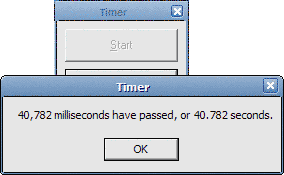

<div align="center">

## Timer Class Module


</div>

### Description

This class module contains everything needed for creating a timer. It is very simple (18 lines), but provides millisecond accuracy using the GetTickCount API.
 
### More Info
 
To start the timer: MyTimer.StartTimer

To stop the timer: MyTimer.StopTimer

To read duration: MyTimer.ElapsedTime

Duration the timer has been running in milliseconds (divide by 1000 for seconds).

Due to the fact this is a class module the timer will continue to run even if a message box is displayed - the normal VB timer will pause when a messagebox is displayed. This can be an advantage or disadvantage, so take note.


<span>             |<span>
---                |---
**Submitted On**   |2005-03-31 08:15:02
**By**             |[James Arnold](https://github.com/Planet-Source-Code/PSCIndex/blob/master/ByAuthor/james-arnold.md)
**Level**          |Beginner
**User Rating**    |5.0 (10 globes from 2 users)
**Compatibility**  |VB 5\.0, VB 6\.0
**Category**       |[VB function enhancement](https://github.com/Planet-Source-Code/PSCIndex/blob/master/ByCategory/vb-function-enhancement__1-25.md)
**World**          |[Visual Basic](https://github.com/Planet-Source-Code/PSCIndex/blob/master/ByWorld/visual-basic.md)
**Archive File**   |[Timer\_Clas1870063312005\.zip](https://github.com/Planet-Source-Code/james-arnold-timer-class-module__1-59748/archive/master.zip)

### API Declarations

```
Dim myTimer as timTimer
Set myTimer = New timTimer
```


